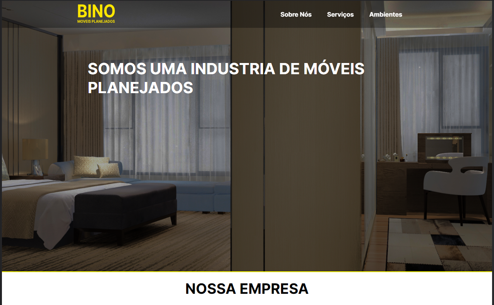
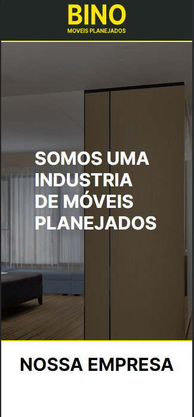
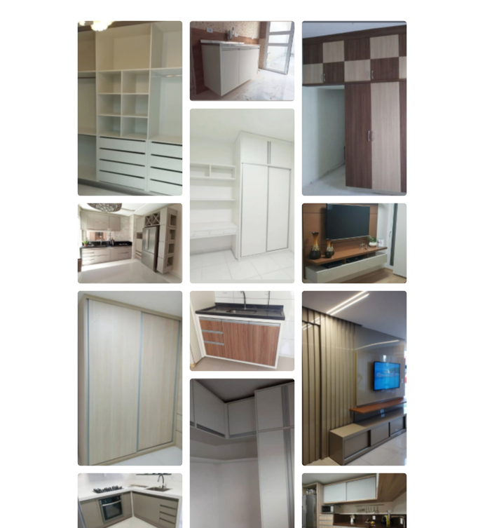

# Bino Móveis

Esse projeto foi desenvolvido como proposta de acrescentar uma presença na web de uma empressa da minha região (Feira de Santana - BA). É uma LandPage contendo informações sibre a empresa como seus valores e sua missão, além disso adcionei imagens dos serviços ja realizados até então num formato de grid que me agradou muito, foquei bastante no quesito responsividade para que a página pudesse oferecer uma boa experiência em dispositivos desktops e smartphones, para que isso fosse possivel utilizei media querys e bastante flexbox para que ficasse tudo ajustado de acordo o tamanho da tela do usuário. 

Figma: https://www.figma.com/file/rknYxNobDYzY03H7xfl7Mx/Bino-Moveis?node-id=2%3A3
Link: https://allanfernds.github.io/bino-moveis/

## Tecnologias utilizadas
* HTML5
* CSS3
* JavaScript

## Layout do projeto

### Autor

LinkedIn: https://www.linkedin.com/in/alanfernds/

Instagram: https://www.instagram.com/_alanfernds/

E-mail: alanfernandes.mm@gmail.com

